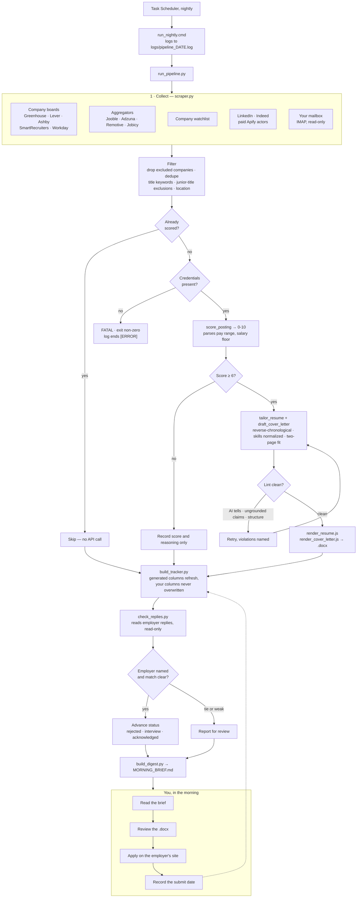

# Document pipeline with deterministic style guardrails

An LLM pipeline that finds job postings, scores them against a profile, and
drafts a tailored resume and cover letter for the ones worth applying to.

The interesting part is not the drafting. It is what happens after.

## The problem this was built to solve

Prompt instructions do not reliably enforce hard constraints.

You can tell a model "never use an em dash" and get an em dash. You can say
"three groups, 2 to 3 bullets each" and get four groups. You can say "every
metric must appear in the profile" and get a number the model derived by
multiplying two others. Instructions hold most of the time, which is worse
than never holding, because it means the failures are occasional and you stop
checking.

So this pipeline does not trust the prompt for anything that must be true.
Every hard constraint is checked in code after generation, and violations are
fed back to the model as a corrective retry.

```
generate -> lint -> violations? -> retry with the violations named -> lint
```

The prompt still carries the instruction. The lint is what makes it binding.

The same treatment applies to a response that is not valid JSON, which no
amount of "respond ONLY with JSON" prevents. One resume died on `Expecting ','
delimiter: line 43 column 6`; the cover letter for the same posting drafted
fine, and a plain retry produced valid JSON with no prompt change. The parse
error is now handed back the way a lint violation is, so a transient failure
costs a few seconds instead of a document. Truncation is the exception and is
not retried: asking again with the same token budget truncates again, so it
raises and names the budget to raise.

## What gets enforced

| Check | What it catches |
|---|---|
| `find_ai_tells` | em dashes, "not just X but Y", "resonates", "passionate about", "at the intersection of", filler intensifiers |
| `find_style_issues` | wrong group count, missing headers, duplicate headers, overlong bullets, a letter where most bullets carry no metric, employer, or named method |
| `find_ungrounded_claims` | numbers that appear nowhere in the profile, invented scope ("dozens of verticals") |
| `order_experience` | work history out of reverse-chronological order; company names carrying internal descriptors |
| `fit_to_two_pages` | resumes that would spill past two pages |
| `normalize_skills` | skills formatting drifting between documents |
| `exclude_title_keywords` | junior and unrelated roles the broad keyword stems drag in, filtered before anything reaches the scorer |

Each of these exists because of a specific failure that reached a finished
document. A few worth naming:

**The model reordered employment history.** Asked to tailor a resume to an
agency posting, it promoted the most relevant employer to the top, which put
a 2010-2015 role above a 2020-2022 one. It looked deliberate and was wrong in
all six resumes generated that run. Sorting against the profile's own order
turned out to be more reliable than parsing free-text date strings.

**The model invented a client roster.** The profile gives each employer a
`company_descriptor` describing the employer's business, so the model
understands the setting. It read those markets as the candidate's own
accounts and wrote them into bullets. The fix was both a prompt block
distinguishing the two, and a lint that flags vague quantifiers.

**The lint caught a claim that was faithfully copied.** A bullet described
building something the candidate had not built. The lint fired, the retry
rewrote it, and it turned out the claim was in the profile, accurate to the
letter and wrong in fact. The instrument was right and the source data was
bad. Worth remembering when a guardrail flags something you "know" is fine.

**A comment is not a guardrail.** A helper carried the comment "generated
company fields carry descriptors, e.g. 'Golden Hippo (Health/Wellness/CPG,
~$1B revenue)'" for weeks. It knew. It sorted correctly and stripped nothing,
so whether internal profile notes reached the page was left to the model. Two
finished resumes shipped with them before anyone looked. Twenty-two were
affected once checked.

## Tuning guardrails is the actual work

The first version of the style lint was too aggressive. A rule capping
sentence length at 30 words produced three consecutive same-length sentences,
which reads worse than what it replaced. Another check flagged a paragraph the
candidate had personally written and approved. Both were removed.

A guardrail that fires on good output trains you to ignore it. The threshold
matters as much as the rule, and the only way to set it is to run it against
work you already believe in.

## Architecture



Python for the pipeline, Node for document rendering, Anthropic's API for
scoring and drafting. `scraper.py` also does schema.org JobPosting extraction
for arbitrary URLs, so a posting someone sends you can be scored without
belonging to any source above.

The dotted line is the part that matters: the loop only closes when you type
the submit date yourself.

Two sources are worth calling out. **Your mailbox** is the only one that finds
roles no board lists, because a recruiter writing to you directly is not
posted anywhere. **LinkedIn and Indeed** have no usable public API and their
terms forbid scraping, so nothing here touches them; paid third-party actors
do, billed per result. That bill is why the filtering is pushed into the
request rather than applied to the response: a result you receive and then
discard has already been paid for. LinkedIn takes explicit title filters.
Indeed takes none, but passes its own query syntax through, so the filter goes
in the query — `title:(("marketing analytics") AND (director OR "head of"))`.
Filtering after the fact instead cost four wasted results in every five.

Neither actor's documentation describes what it returns accurately, so both
were probed for a few cents before either was wired in, and what the probes
found is written down in `boards.example.yaml` next to the settings it
explains. Two filters that look identical across the two sites behave in
opposite ways: Indeed's remote filter works and LinkedIn's does nothing.

## Failures are loud, or they are not failures

Every source is wrapped so one dead board cannot take down a run. That
isolation once swallowed something it should not have: a missing API key made
every posting fail, each failure was caught by the per-posting handler, and the
log still ended with `[OK] pipeline completed`. Scoring was dead for three days
before anyone noticed.

Two rules came out of it. An authentication failure is fatal for the whole run,
never a per-posting problem, and the run checks for a usable credential before
it starts rather than discovering the problem 200 postings in. A run that could
not do its job exits non-zero and says why.

The same applies to what the log itself contains. Adzuna passes credentials as
URL query parameters, and the default HTTP error message includes the whole
URL, so every timeout wrote an API key in plaintext to disk. Errors now report
the status and the query, never the URL.

## Reading replies back out of the mailbox

A tracker only knows what you typed into it, so an application sits at
"applied" long after the company has answered. Three rejections and one
scheduled interview were sitting unread in one inbox while the morning brief
called them all "gone quiet".

`check_replies.py` runs after the pipeline, searches the mailbox server-side
for reply-shaped mail, classifies each message as rejected / interview /
acknowledged, matches it to an application, and advances the tracker. It opens
the mailbox read-only: nothing is marked read, moved, or deleted, and it never
sends anything.

Matching is the part that has to be right, because a wrong rejection is worse
than no automation at all. Three rules, each of which exists because the naive
version got it wrong on real mail:

- **The employer must be named** in the message or the sender. Scoring on title
  alone matched a Jack Morton rejection to the OnePay application, because half
  these roles are called "Director, Marketing Analytics".
- **Job boards are not employers.** A LinkedIn posting URL made "linkedin" an
  employer key, and that word sits in the footer of most email.
- **Ties are reported, not applied.** Two applications at the same company both
  match its rejection mail; closing the wrong one is worse than closing
  neither.

Your own edits are safe: a status you typed is never overwritten, and nothing
moves backwards from interview or offer.

## Making it yours

Four files hold everything personal. Each ships as a `.example`; copy it,
edit it, and the real one stays out of git.

| File | Holds |
|---|---|
| `profile/master_profile.json` | work history, education, positioning |
| `profile/skills_inventory.csv` | skills, and the ones you're tracking as gaps |
| `config/titles.csv` | what to search for, and what to exclude |
| `config/letter.yaml` | the cover letter's fixed paragraphs and the style rules |
| `config/tuning.yaml` | thresholds, limits, and the model |
| `config/boards.yaml` | which boards and sources to query |

`titles.csv` is a spreadsheet rather than a YAML list for the same reason the
skills file is: these change weekly. A row can be switched off with
`active=no` instead of deleted, and the `notes` column records why a term is
there. That column earns itself the first time a term looks wrong in six
months — the entry for `data scien` says "catches Data Scientist AND Data
Science", which is the distinction that hid every Staff Data Scientist role
until someone noticed.

`letter.yaml` is the one to edit first. Its three paragraphs appear in every
letter word for word; only the opening sentence and the achievement groups
change per posting. It ships with a `[FILL IN: ...]` placeholder rather than
anyone's real positioning, and `doctor.py` fails while that placeholder is
still in use.

Every config file is optional and each has a built-in default. What none of
them do is fail quietly: a typo'd key, a wrong type, an invalid regex or a
missing column stops the run and names the file and the problem. A config
that is silently ignored looks exactly like one that works, and this project
has been bitten by that shape of bug more than once.

## Checking the setup

```bash
python src/doctor.py            # config, credentials, profile, last run
python src/doctor.py --dry-run  # also scrape the free sources and count
```

It makes no API calls and writes nothing. The dry run reports how many
postings survive your filters and how many have never been scored, so you can
see what a real run would cost before spending anything. It skips the paid
LinkedIn and Indeed sources unless you pass `--include-paid`, because a
diagnostic that bills per result is a bad diagnostic.

It also reports a credential that is set for your user account but missing from
the shell doctor is running in, rather than calling it absent. Some parents
strip variables from what they hand to child processes, and "you have no API
key" is the wrong thing to tell someone whose scheduled run is using one.

Exit code 1 means something is actually broken, so a wrapper can tell
"misconfigured" from "nothing to do".

## The profile is two files, and the skills file wins

`profile/master_profile.json` holds work history, education, and positioning
notes. Achievements carry their metrics; the drafting step is told to use
nothing that is not in here.

`profile/skills_inventory.csv` is the source of truth for skills. It is a
spreadsheet on purpose, because skills change weekly and JSON is a hostile
place to edit a list of 90 things.

| column | meaning |
|---|---|
| `category` | grouping, e.g. Marketing Measurement, Languages & Query. A `Certifications` category is routed to the certifications list instead. |
| `skill` | the skill itself |
| `have_it` | `yes` puts it on resumes. Anything else excludes it. |
| `proficiency` | Expert / Advanced / Working / Familiar, so the model can lead with real strengths |
| `source` | where the row came from; informational |
| `notes` | free text, appended in brackets |

Two decisions here matter more than the format.

**The CSV replaces the JSON's skill fields rather than merging with them.**
When both exist, the model never sees two contradictory skill lists, and there
is never a question about which one is current.

**Rows you do not have stay in the file**, marked `have_it=no`. A skill named
in job postings that you cannot claim is useful information, and deleting it
loses the fact that you looked at it and decided. Those rows are excluded from
every document, so the model cannot claim them, while the file still tracks
the gap between what postings ask for and what you can honestly say.

There is deliberately no script to regenerate the CSV from the JSON. Once the
CSV exists it is authoritative, and regenerating it would quietly discard your
edits.

## It never submits an application

The pipeline stops at drafted documents. It does not open application forms,
fill them, or submit anything. A human reads what goes out under their name,
and the volume a tool like this enables is what makes that review matter more,
not less.

An autofill step was prototyped and then removed. Application forms differ per
employer even on the same applicant-tracking system, and keeping selectors
working across them is ongoing maintenance for a step that takes a person two
minutes. Browser extensions built for this already do it better.

## Setup

```bash
pip install -r requirements.txt
cd src && npm install
export ANTHROPIC_API_KEY=...        # required (or sign in with `ant auth login`)
export JOOBLE_API_KEY=...           # optional, aggregator sources
export ADZUNA_APP_ID=... ADZUNA_APP_KEY=...
export APIFY_TOKEN=...              # optional, LinkedIn + Indeed via Apify
                                    # actors. These bill per result; both ship
                                    # disabled in boards.example.yaml.
export IMAP_USER=... IMAP_APP_PASSWORD=...   # optional, mailbox source + reply
                                             # checking. Use an app password,
                                             # never your account password.
```

Copy the examples and fill them in:

```bash
cp profile/master_profile.example.json profile/master_profile.json
cp profile/skills_inventory.example.csv profile/skills_inventory.csv
cp config/boards.example.yaml config/boards.yaml
cp config/general_resume_keep.example.json config/general_resume_keep.json
python src/run_pipeline.py
```

`profile/` and `config/boards.yaml` are gitignored. The pipeline reads who you
are from the profile; no personal details live in the code.

## Provenance

Claude wrote most of this code. The direction, the evaluation, and the
judgment about what "good" means were mine: deciding the tool must never
auto-submit, noticing the drafts read as machine-written and turning that into
the lint-and-retry design, and setting the thresholds by testing them against
letters I had already sent.

The scarce skill here is not typing the code. It is knowing when the output is
wrong, and building something that catches it next time.

## License

MIT
