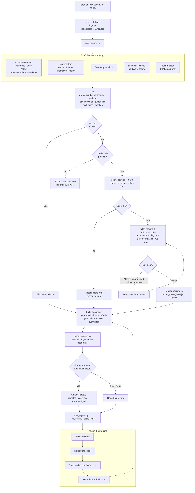

# Document pipeline with deterministic style guardrails

An LLM pipeline that finds job postings, scores them against a profile, and
drafts a tailored resume and cover letter for the ones worth applying to.

The interesting part is not the drafting. It is what happens after.

## Quickstart

Needs Python 3.10 or newer, and Node 18 or newer to render the .docx files.

```bash
pip install -r requirements.txt
cd src && npm install && cd ..

cp config/boards.example.yaml  config/boards.yaml       # which boards to query
cp config/titles.example.csv   config/titles.csv        # what to search for
cp config/letter.example.yaml  config/letter.yaml       # your cover letter frame
cp profile/master_profile.example.json profile/master_profile.json
cp profile/skills_inventory.example.csv profile/skills_inventory.csv

export ANTHROPIC_API_KEY=...        # the only credential that is required

python src/doctor.py --dry-run      # no API calls; says what is still missing
python src/run_nightly.py           # the real thing, with a log
```

Edit the four copied files before the first real run: the profile is who you
are, `letter.yaml` ships with a `[FILL IN: ...]` placeholder that doctor refuses
to run with, `titles.csv` is what gets searched, and `boards.yaml` is where.
`doctor.py` names anything still wrong and exits non-zero, so start there.

`tuning.yaml` and `general_resume_keep.json` are optional - both have working
defaults. Everything else is in **Setup** and **Making it yours** below.

Expect around **$0.70 a night** in API spend on a search this size. See **What
it costs** for the measured figures and the levers.

## The problem this was built to solve

Prompt instructions do not reliably enforce hard constraints.

You can tell a model "never use an em dash" and get an em dash. You can say
"three groups, 2 to 3 bullets each" and get four groups. You can say "every
metric must appear in the profile" and get a number the model derived by
multiplying two others. Instructions hold most of the time, which is worse
than never holding, because it means the failures are occasional and you stop
checking.

So this pipeline does not trust the prompt for anything that must be true.
Every hard constraint is checked in code after generation, and violations are
fed back to the model as a corrective retry.

```
generate -> lint -> violations? -> retry with the violations named -> lint
```

The prompt still carries the instruction. The lint is what makes it binding.

The same treatment applies to a response that is not valid JSON, which no
amount of "respond ONLY with JSON" prevents. One resume died on `Expecting ','
delimiter: line 43 column 6`; the cover letter for the same posting drafted
fine, and a plain retry produced valid JSON with no prompt change. The parse
error is now handed back the way a lint violation is, so a transient failure
costs a few seconds instead of a document. Truncation is the exception and is
not retried: asking again with the same token budget truncates again, so it
raises and names the budget to raise.

## What gets enforced

| Check | What it catches |
|---|---|
| `find_ai_tells` | em dashes, "not just X but Y", "resonates", "passionate about", "at the intersection of", filler intensifiers |
| `find_style_issues` | wrong group count, missing headers, duplicate headers, overlong bullets, a letter where most bullets carry no metric, employer, or named method |
| `find_ungrounded_claims` | numbers that appear nowhere in the profile, invented scope ("dozens of verticals") |
| `order_experience` | work history out of reverse-chronological order; company names carrying internal descriptors |
| `fit_to_two_pages` | resumes that would spill past two pages |
| `normalize_skills` | skills formatting drifting between documents |
| `exclude_title_keywords` | junior and unrelated roles the broad keyword stems drag in, filtered before anything reaches the scorer |
| `extract_salary_range` | hourly rates read as salaries, and location-premium or foreign-currency bands read as the role's pay |

Each of these exists because of a specific failure that reached a finished
document. A few worth naming:

**The model reordered employment history.** Asked to tailor a resume to an
agency posting, it promoted the most relevant employer to the top, which put
a 2010-2015 role above a 2020-2022 one. It looked deliberate and was wrong in
all six resumes generated that run. Sorting against the profile's own order
turned out to be more reliable than parsing free-text date strings.

**The model invented a client roster.** The profile gives each employer a
`company_descriptor` describing the employer's business, so the model
understands the setting. It read those markets as the candidate's own
accounts and wrote them into bullets. The fix was both a prompt block
distinguishing the two, and a lint that flags vague quantifiers.

**The lint caught a claim that was faithfully copied.** A bullet described
building something the candidate had not built. The lint fired, the retry
rewrote it, and it turned out the claim was in the profile, accurate to the
letter and wrong in fact. The instrument was right and the source data was
bad. Worth remembering when a guardrail flags something you "know" is fine.

**A plausible wrong number is worse than none.** The pay parser took the
largest annual range it could find, on the theory that a posting mentions many
numbers and the biggest is the salary. Postings state several ranges on purpose.
One listed $160,300-$253,600 for the role and $192,300-$304,200 "in the select
locations listed above", and the tracker recorded the premium band for metros
the candidate does not live in. Another gave a USD range followed by two CAD
ranges, and the largest pair was Canadian dollars stored as dollars. The range
a posting states first is its general one, so the first range in a pay context
now wins. Separately, cents used to disqualify a range as an hourly rate, which
threw away `$160,300.00/yr` -- cents mean a rate on a small number and mean
nothing on a large one.

**A comment is not a guardrail.** A helper carried the comment "generated
company fields carry descriptors, e.g. 'Northwind Retail (Home goods/CPG,
~$1B revenue)'" for weeks. It knew. It sorted correctly and stripped nothing,
so whether internal profile notes reached the page was left to the model. Two
finished resumes shipped with them before anyone looked. Twenty-two were
affected once checked.

## Tuning guardrails is the actual work

The first version of the style lint was too aggressive. A rule capping
sentence length at 30 words produced three consecutive same-length sentences,
which reads worse than what it replaced. Another check flagged a paragraph the
candidate had personally written and approved. Both were removed.

A guardrail that fires on good output trains you to ignore it. The threshold
matters as much as the rule, and the only way to set it is to run it against
work you already believe in.

## Architecture



Python for the pipeline, Node for document rendering, Anthropic's API for
scoring and drafting. `scraper.py` also does schema.org JobPosting extraction
for arbitrary URLs, so a posting someone sends you can be scored without
belonging to any source above.

The dotted line is the part that matters: the loop only closes when you type
the submit date yourself.

Two sources are worth calling out. **Your mailbox** is the only one that finds
roles no board lists, because a recruiter writing to you directly is not
posted anywhere. **LinkedIn and Indeed** have no usable public API and their
terms forbid scraping, so nothing here touches them; paid third-party actors
do, billed per result. That bill is why the filtering is pushed into the
request rather than applied to the response: a result you receive and then
discard has already been paid for. LinkedIn takes explicit title filters.
Indeed takes none, but passes its own query syntax through, so the filter goes
in the query — `title:(("marketing analytics") AND (director OR "head of"))`.
Filtering after the fact instead cost four wasted results in every five.

Neither actor's documentation describes what it returns accurately, so both
were probed for a few cents before either was wired in, and what the probes
found is written down in `boards.example.yaml` next to the settings it
explains. Two filters that look identical across the two sites behave in
opposite ways: Indeed's remote filter works and LinkedIn's does nothing.

## Failures are loud, or they are not failures

Every source is wrapped so one dead board cannot take down a run. That
isolation once swallowed something it should not have: a missing API key made
every posting fail, each failure was caught by the per-posting handler, and the
log still ended with `[OK] pipeline completed`. Scoring was dead for three days
before anyone noticed.

Two rules came out of it. An authentication failure is fatal for the whole run,
never a per-posting problem, and the run checks for a usable credential before
it starts rather than discovering the problem 200 postings in. A run that could
not do its job exits non-zero and says why.

The same applies to what the log itself contains. Adzuna passes credentials as
URL query parameters, and the default HTTP error message includes the whole
URL, so every timeout wrote an API key in plaintext to disk. Errors now report
the status and the query, never the URL.

There is a quieter failure than a crash, and it took longer to find: code that
works exactly as written while nothing shows what it costs. The LinkedIn and
Indeed sources bill per result, and `titles.csv` discards most of what they
return — a typical night keeps 9 of 55. Nothing recorded what the other 46
were. So when the search config asked Indeed for a title that had no matching
row in `titles.csv`, the results were paid for and thrown away, and the only
visible symptom was a source that kept finding nothing. Three settings got
blamed before anyone tested them, and all three were innocent.

Every discarded paid posting now goes to `logs/dropped_paid_titles.csv` with
the reason it was dropped, and the nightly log names the titles that matched no
search term — those are the candidates for a new row. Location drops stay in
the file, because there is nothing to do about them.

```
  linkedin: 9 of 55 posting(s) kept after title and location filters
  linkedin: 46 billed posting(s) dropped (7 no title term, 4 excluded title, 35 location) -> logs/dropped_paid_titles.csv
      no term matched: Director, Revenue Analytics
      no term matched: Head of Business Intelligence
```

The rule this one earned: when a step discards most of its input, make it say
what it discarded. A count is not a diagnosis.

## Reading replies back out of the mailbox

A tracker only knows what you typed into it, so an application sits at
"applied" long after the company has answered. Three rejections and one
scheduled interview were sitting unread in one inbox while the morning brief
called them all "gone quiet".

`check_replies.py` runs after the pipeline, searches the mailbox server-side
for reply-shaped mail, classifies each message as rejected / interview /
acknowledged, matches it to an application, and advances the tracker. It opens
the mailbox read-only: nothing is marked read, moved, or deleted, and it never
sends anything.

Matching is the part that has to be right, because a wrong rejection is worse
than no automation at all. Three rules, each of which exists because the naive
version got it wrong on real mail:

- **The employer must be named** in the message or the sender. Scoring on title
  alone matched one company's rejection to another company's application, because half
  these roles are called "Director, Marketing Analytics".
- **Job boards are not employers.** A LinkedIn posting URL made "linkedin" an
  employer key, and that word sits in the footer of most email.
- **Ties are reported, not applied.** Two applications at the same company both
  match its rejection mail; closing the wrong one is worse than closing
  neither.

The mailbox source has the mirror-image problem: a reply is not an opening, and
it arrives looking like one. "Your application for Director, Marketing
Measurement & Testing" matches the title keywords perfectly.

The first attempt reused the matcher above, dropping a message only when it
tied to an application on file. That is the wrong test, and it fails on exactly
the mail that matters: an acknowledgement is sent through the ATS, so its
sender is `jobvite.com` or `myworkday.com`, its employer name is one the
matcher discards as a generic host, and the tracker row has to carry a submit
date you remembered to type. Four replies were scored as jobs in one night, one
of them an interview invitation that reached 8/10 and had documents drafted
for it.

Some subjects need no corroboration. A posting alert never says "your
application", so the subject alone settles it, and a subject carrying your own
full name next to the word "interview" is about you rather than a vacancy. The
weaker signals — a bare "interview", wording a recruiter might also use about a
genuinely new role — still have to tie to something you applied to. Checked
against 243 real subjects from a three-week window: 20 matched, every one of
them a reply, and nothing that mentions interviews in passing ("How to land a
job interview!") was touched.

Your own edits are safe: a status you typed is never overwritten, and nothing
moves backwards from interview or offer.

## Making it yours

Four files hold everything personal. Each ships as a `.example`; copy it,
edit it, and the real one stays out of git.

| File | Holds |
|---|---|
| `profile/master_profile.json` | work history, education, positioning |
| `profile/skills_inventory.csv` | skills, and the ones you're tracking as gaps |
| `config/titles.csv` | what to search for, and what to exclude |
| `config/letter.yaml` | the cover letter's fixed paragraphs and the style rules |
| `config/tuning.yaml` | thresholds, limits, and the model |
| `config/boards.yaml` | which boards and sources to query |

`titles.csv` gates every source, including the two that bill per result, and it
is applied to those after the bill. So a title worth searching for on Indeed or
LinkedIn needs a row here as well as a place in the query, or you are paying for
results the pipeline then discards. `logs/dropped_paid_titles.csv` is where to
look when a paid source seems quiet.

`titles.csv` is a spreadsheet rather than a YAML list for the same reason the
skills file is: these change weekly. A row can be switched off with
`active=no` instead of deleted, and the `notes` column records why a term is
there. That column earns itself the first time a term looks wrong in six
months — the entry for `data scien` says "catches Data Scientist AND Data
Science", which is the distinction that hid every Staff Data Scientist role
until someone noticed.

`letter.yaml` is the one to edit first. Its three paragraphs appear in every
letter word for word; only the opening sentence and the achievement groups
change per posting. It ships with a `[FILL IN: ...]` placeholder rather than
anyone's real positioning, and `doctor.py` fails while that placeholder is
still in use.

Every config file is optional and each has a built-in default. What none of
them do is fail quietly: a typo'd key, a wrong type, an invalid regex or a
missing column stops the run and names the file and the problem. A config
that is silently ignored looks exactly like one that works, and this project
has been bitten by that shape of bug more than once.

## Checking the setup

```bash
python src/doctor.py            # config, credentials, profile, last run
python src/doctor.py --dry-run  # also scrape the free sources and count
```

It makes no API calls and writes nothing. The dry run reports how many
postings survive your filters and how many have never been scored, so you can
see what a real run would cost before spending anything. It skips the paid
LinkedIn and Indeed sources unless you pass `--include-paid`, because a
diagnostic that bills per result is a bad diagnostic.

It reads the last week of logs for two things that hide in plain sight. A board
token that has been removed fails every night as one `[warn]` line, which is
how two of them went unnoticed for weeks. And a retry, which exists to absorb a
transient failure, absorbs a permanent one just as quietly: a prompt or schema
that has drifted into failing every time looks like a working pipeline billed
twice. So doctor counts the retries and says when the rate stops looking like
bad luck. It judges the most recent run on its own as well as the window,
because a rate averaged over a week hides a failure that started last night.

It also reports a credential that is set for your user account but missing from
the shell doctor is running in, rather than calling it absent. Some parents
strip variables from what they hand to child processes, and "you have no API
key" is the wrong thing to tell someone whose scheduled run is using one.

Exit code 1 means something is actually broken, so a wrapper can tell
"misconfigured" from "nothing to do".

## What it costs

Measured on `claude-sonnet-5` at $2.00 per million input tokens and $10.00 per
million output, by reading `response.usage` on real calls rather than
estimating from character counts:

| | input | output | cost |
|---|---|---|---|
| Score one posting | 9,141 | 260 | **$0.021** |
| Draft a resume | 9,787 | 4,287 | $0.062 |
| Draft a cover letter | 11,393 | 2,081 | $0.044 |
| A document pair | | | **$0.106** |

Across seven consecutive nights on a search covering 49 Greenhouse boards and a
dozen other sources, that worked out to between **$0.10 and $2.40 a night**,
averaging $1.14, or about $34 a month. The spread is the whole story: a quiet
night scores five postings, and a Monday after a long weekend scores 64.

Four things follow from the shape of those numbers.

**Scoring is the bill, not drafting.** Drafting costs five times more per
document, but only postings at or above the threshold get documents, so scoring
29 postings dominates drafting 5 pairs. If you want to spend less, filter
harder: `titles.csv` and the location list decide what reaches the model at all,
and `doctor.py --dry-run` counts what would be scored before you spend anything.

**Nothing is scored twice.** A posting whose URL is already in
`output/scored_postings.json` is skipped, so re-running the same night costs
nothing and a long-running install converges on scoring only what is new.

**Input dominated by a factor of 35 on scoring, so the profile is cached.**
Every call resends the whole profile, and those bytes are identical for every
posting in a run. The prompt is sent as two blocks - the instruction line and
the profile first, marked `cache_control: ephemeral`, then everything
posting-specific - so the first call of a run writes a 7,380-token entry and the
rest read it at a tenth of the price. Measured on the input side, which is all
caching touches:

| | input cost before | after | |
|---|---|---|---|
| Score a posting | $0.0183 | $0.0054 | 70% less |
| Draft a resume | $0.0196 | $0.0068 | 65% less |
| Draft a cover letter | $0.0228 | $0.0101 | 56% less |

Holding output constant, a 29-scored, 5-drafted night goes from **$1.14 to
$0.69**, roughly $34 a month to $21.

Three caveats worth knowing. A write costs 1.25x, so the first posting of a run
is slightly *more* expensive and the saving starts with the second. Output is
untouched and varies a lot - the same resume prompt returned 4,287 output tokens
one run and 7,893 another, which at $10 per million swamps the input saving on
drafting, so judge drafting cost over a week rather than a call. And the three
prompts open with different instruction lines, so each keeps its own entry:
sharing one would mean moving that line after the profile, which is a real
change to a tuned prompt for about a dollar a month.

The entry lives for five minutes and every read refreshes it, so a run that
works through postings back to back keeps it warm start to finish - across
processes too, so a `--repair` a few minutes later reads the same entry. A
profile much smaller than this one may fall under the 1,024-token minimum, where
the marker is ignored and costs nothing.

Every run says what it spent and whether the cache was doing its job:

```
  39 model call(s), 312,480 in / 34,120 out, about $0.69 -- prompt cache saved about $0.41
```

That line exists because a cache is the easiest thing in this pipeline to break
without noticing. One changed byte ahead of the breakpoint - a key reordered in
the profile, a word added to the instruction line - and every call writes a
fresh entry, reads nothing, and costs more than it did before caching, while
raising no error and producing identical documents. When writes happen and no
read follows, the line says so instead of quietly reporting a bigger number.

**The paid sources are the small line.** LinkedIn and Indeed bill per result
through Apify and ship disabled. A measured Indeed night returned 3 results for
about $0.002; both are capped by `limit_per_search`, so they stay in cents as
long as the queries are narrow. Every other source is free.

Two things cost nothing: `doctor.py` in any form, and the test suite.

## Tests

```bash
python -m unittest discover -s tests        # 218 tests, well under a second
python -m unittest discover -s tests -v     # with names
```

No dependencies beyond the ones the pipeline already needs, no API calls, no
network, and nothing read from `profile/` or `config/` — every input is built in
`tests/helpers.py`, so the suite passes on a bare clone before you have
configured anything. `pytest tests` works too if you prefer it.

What they cover is the argument this README makes: the guardrails. The lints on
a drafted letter, the reshaping applied to a drafted resume, the pay-range
parser, the title and mailbox filters, the JSON retry policy, the reply matcher,
the config loaders refusing bad input, and the two log checks. Each test names
the failure that made the rule necessary, so the suite doubles as the list of
things that have gone wrong.

Several deliberately assert what must *not* happen, because that is where the
cost is. A rejection matched to the wrong application closes a live one. A
filter that drops too much used to be invisible: you never saw the job it hid,
which is why the dropped-posting log above exists.

A suite that passes proves nothing until it has been shown to fail, so the six
fixes most worth protecting were each reverted to confirm the tests go red. All
six were caught.

The same exercise on the dropped-posting tests is the better advertisement for
the method, because it failed. Five of six mutations went red; the sixth, which
swapped the order of the two title checks, passed. The test meant to pin that
order used "Marketing Analytics Intern", which matches a search term *and* hits
an exclusion, so both orderings agreed on the answer and the test could not tell
them apart. It needed a title that matches no term and is also excluded. The
test was rewritten, not the code. A test you have not tried to break is a guess
about what it covers.

If you change a lint or a regex, run these first; if you tighten a rule on
purpose, expect a test to fail and update it deliberately.

## A resume is a selection; the profile should not be

`master_profile.json` is a working JSON file: 21 keys, work history nested two
deep, 200-odd lines. Nobody should author that by hand, and the shape of it
caused a subtler problem than the typing.

The profile it was filled from came out of resumes, and a resume is capped at two
pages. So it inherited a selection made for one application — 41 accomplishments
and 898 words for an entire career. The pipeline could only ever draw on what
survived that cut.

**`profile/master.md` is the fix.** No page limit, one block per accomplishment,
and each one recorded as Problem / Actions / Results rather than as a finished
bullet. That last part matters: a bullet has already been edited for one reader,
while the raw material lets the drafting step compose a sentence that fits the
posting in front of it. Start from `profile/master.example.md`, and add to it over
months — nobody recalls a career in one sitting.

### The interview

```bash
python src/interview.py --coverage          # what the record holds; no API calls
python src/interview.py                     # start wherever it is thinnest
python src/interview.py --role Northwind    # one employer
```

The hard part of a master record is not typing, it is recall. Nobody can list
fifteen accomplishments on demand, and a resume has trained them to name the two
or three that suited one application. A question they can answer surfaces work
that "list your achievements" does not.

So `interview.py` asks one question at a time and looks for evidence in
descending order of strength, stopping at the first rung that holds:

| | |
|---|---|
| `metric` | a number they already knew |
| `derived` | a number worked out from before-and-after |
| `scope` | the size of the work, not its outcome |
| `qualitative` | a contribution with no number attached |

The second rung is where most of the value is, because people hold numbers
without realising. "I automated the reporting" is not a metric. Asked how long
it took before, how long it takes now and how often it runs, the same person
produces "three days a month became half a day" — which is. Which rung an
accomplishment landed on is stored, so the build step can prefer quantified
material and the person can see their own coverage.

`qualitative` is a real answer and the prompt forbids inventing a number to
avoid it. Plenty of good work changes no figure anyone measured.

Three rules keep it from becoming tiring, which is the main risk in anything
that asks a lot of questions:

- **It never asks about something already recorded.** Existing titles go into
  the prompt, and a near-duplicate is refused locally even if the prompt misses it.
- **The nudge toward more is a coverage number, shown once per role** — not the
  question "any more?" asked ten times.
- **When someone says they are out of material, it offers exactly one more
  question, from the angle the record least covers**, then lets go for good.
  People usually mean they are out of the kind of material they have been
  thinking about; a question about who they hired, or what was broken when they
  arrived, or what outlasted them, often lands. The counter lives in code rather
  than in the prompt, because "once, and then stop" is the sort of rule a model
  drifts on.

Everything is saved as it is confirmed, so stopping mid-role costs nothing and
Ctrl-C is a supported way to leave. Reckon on two to three cents per
accomplishment.

If you have ever filled in a resume-development questionnaire for a career coach,
you already have most of it written down:

```bash
python src/import_intake.py "2023 Resume Development Document.docx"
```

That reads the .docx with the standard library — no new dependency — and writes
`profile/master.md`. Nothing is rewritten, summarised or inferred; every line is
copied text. Anything the parser does not recognise goes to an **Unparsed**
section rather than being dropped, because a parser that quietly discards half a
document looks exactly like one that works. It refuses to overwrite an existing
`master.md`, and it is additive by nature: it knows only what was written down at
the time, so roles the document predates still need adding by hand.

Run it on one real document and the output tells you where the gaps are. On the
document this was built against, one role of four came back with no
accomplishments at all and the answer "All in resume" — which is exactly the kind
of hole a resume-derived profile hides.

`profile/master_profile.json` is still what the pipeline reads: work history,
education, and positioning notes, with achievements carrying their metrics, and
the drafting step told to use nothing that is not in there.

`profile/skills_inventory.csv` is the source of truth for skills. It is a
spreadsheet on purpose, because skills change weekly and JSON is a hostile
place to edit a list of 90 things.

| column | meaning |
|---|---|
| `category` | grouping, e.g. Marketing Measurement, Languages & Query. A `Certifications` category is routed to the certifications list instead. |
| `skill` | the skill itself |
| `have_it` | `yes` puts it on resumes. Anything else excludes it. |
| `proficiency` | Expert / Advanced / Working / Familiar, so the model can lead with real strengths |
| `source` | where the row came from; informational |
| `notes` | free text, appended in brackets |

Two decisions here matter more than the format.

**The CSV replaces the JSON's skill fields rather than merging with them.**
When both exist, the model never sees two contradictory skill lists, and there
is never a question about which one is current.

**Rows you do not have stay in the file**, marked `have_it=no`. A skill named
in job postings that you cannot claim is useful information, and deleting it
loses the fact that you looked at it and decided. Those rows are excluded from
every document, so the model cannot claim them, while the file still tracks
the gap between what postings ask for and what you can honestly say.

There is deliberately no script to regenerate the CSV from the JSON. Once the
CSV exists it is authoritative, and regenerating it would quietly discard your
edits.

## It never submits an application

The pipeline stops at drafted documents. It does not open application forms,
fill them, or submit anything. A human reads what goes out under their name,
and the volume a tool like this enables is what makes that review matter more,
not less.

An autofill step was prototyped and then removed. Application forms differ per
employer even on the same applicant-tracking system, and keeping selectors
working across them is ongoing maintenance for a step that takes a person two
minutes. Browser extensions built for this already do it better.

## Setup

The short version is in **Quickstart** at the top. This is the full credential
list and what each one buys.

```bash
export ANTHROPIC_API_KEY=...        # required (or sign in with `ant auth login`)
export JOOBLE_API_KEY=...           # optional, aggregator sources
export ADZUNA_APP_ID=... ADZUNA_APP_KEY=...
export APIFY_TOKEN=...              # optional, LinkedIn + Indeed via Apify
                                    # actors. These bill per result; both ship
                                    # disabled in boards.example.yaml.
export IMAP_USER=... IMAP_APP_PASSWORD=...   # optional, mailbox source + reply
                                             # checking. Use an app password,
                                             # never your account password.
```

Every file you copy in **Quickstart** is gitignored, along with `output/` and
`logs/`. The pipeline reads who you are from the profile; no personal details
live in the code. One more example is worth copying once you are running:

```bash
cp config/general_resume_keep.example.json config/general_resume_keep.json
cp config/tuning.example.yaml config/tuning.yaml    # thresholds, limits, model
```

Both are optional - each setting falls back to a working default, and
`tuning.yaml` is where to change the scoring threshold, the salary floor, and
the model once you have seen a few nights of output.

## Running it nightly

`src/run_nightly.py` runs the pipeline, reads replies out of the mailbox, and
writes the morning brief, appending everything to `logs/pipeline_YYYY-MM-DD.log`
and keeping 30 days of them. Run it directly, or through the wrapper for your
scheduler:

```bash
python src/run_nightly.py        # any OS
./run_nightly.sh                 # macOS, Linux
run_nightly.cmd                  # Windows
```

The log is the point, not a side effect. `doctor.py` reads the last week of
logs to tell a board that has stopped working from one that timed out once, and
to tell a retry that recovered from a prompt that has started failing every
time. Neither check can say anything until there are logs to read, so run it
this way rather than invoking `run_pipeline.py` on a timer.

To schedule it, on **macOS or Linux**, `crontab -e` and a 6am run:

```
0 6 * * * /full/path/to/run_nightly.sh
```

On **Windows**, Task Scheduler, pointing at `run_nightly.cmd` with the project
folder as "Start in". A scheduled task does not always inherit your interactive
`PATH`, so if it fails to find Python, set `JOB_PIPELINE_PYTHON` to the full
path of your interpreter; both wrappers honour it.

Exit code 0 means the pipeline finished, and the log's last line says which of
`[OK]`, `[OK with WARNING]` (the tracker was open in Excel, so nothing was
saved) or `[ERROR]` applies.

## Provenance

Claude wrote most of this code. The direction, the evaluation, and the
judgment about what "good" means were mine: deciding the tool must never
auto-submit, noticing the drafts read as machine-written and turning that into
the lint-and-retry design, and setting the thresholds by testing them against
letters I had already sent.

The scarce skill here is not typing the code. It is knowing when the output is
wrong, and building something that catches it next time.

## License

MIT
